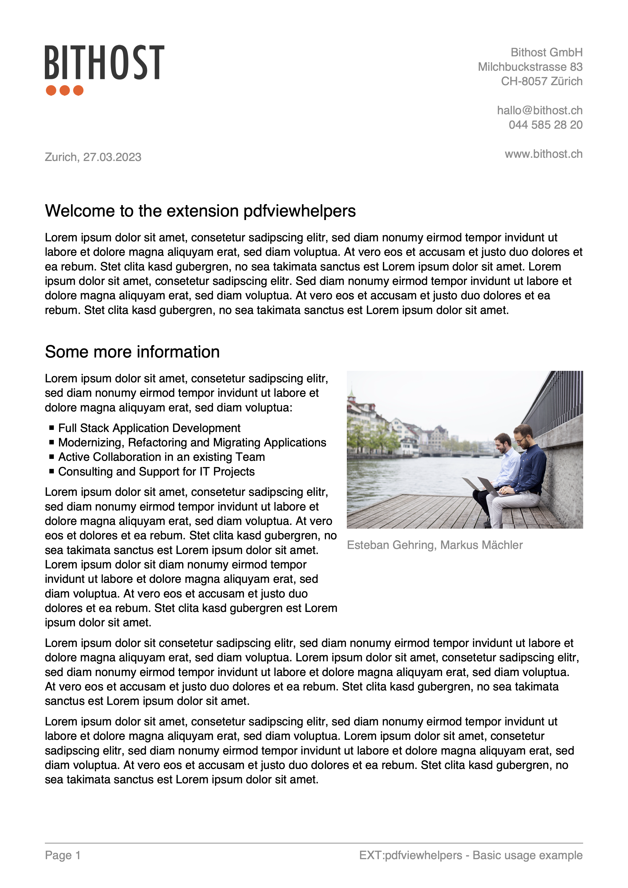

.. ==================================================
.. FOR YOUR INFORMATION
.. --------------------------------------------------
.. -*- coding: utf-8 -*- with BOM.

.. include:: ../../Includes.txt

.. _basicusage:

Basic Usage
===========

.. _basicusage_typoscript:

TypoScript
----------

::

	pdfpage = PAGE
	pdfpage {
		10 = FLUIDTEMPLATE
		10 {
			file = EXT:pdfviewhelpers/Resources/Public/Examples/BasicUsage/Template.html
		}
		# ensure there is no other output apart from the pdf
		# take a look at the generated pdf file (end!) in a text editor to verify there is no other output
		# like warnings, error messages or html code
		config {
			disableAllHeaderCode = 1
			xhtml_cleaning = 0
			admPanel = 0
		}
	}

	plugin.tx_pdfviewhelpers.settings {
		config {
			language = eng
		}
		document {
			title = Bithost document
			subject = Autogenerated PDF, By Bithost GmbH
			author = Bithost GmbH
			keywords = Example, Test, Just to show how it works
			creator = TYPO3 pdfviewhelpers
			outputPath = bithost_example.pdf
		}
		header {
			posY = 15
		}
		footer {
			posY = -15
		}
		text {
			paragraphSpacing = 0
		}
		page {
			margin {
				top = 65
				bottom = 25
			}
		}
		graphics {
			line {
				padding {
					top = 0
					bottom = 1.5
				}
			}
		}
	}

	module.tx_pdfviewhelpers < plugin.tx_pdfviewhelpers

.. _basicusage_fluid:

Fluid Template
--------------

::

	<html xmlns="http://www.w3.org/1999/xhtml"
		xmlns:xsi="http://www.w3.org/2001/XMLSchema-instance"
		xmlns:f="http://typo3.org/ns/TYPO3/CMS/Fluid/ViewHelpers"
		xmlns:pdf="http://typo3.org/ns/Bithost/Pdfviewhelpers/ViewHelpers"
		xsi:schemaLocation="http://typo3.org/ns/Bithost/Pdfviewhelpers/ViewHelpers https://pdfviewhelpers.bithost.ch/schema/2.2.xsd"
		data-namespace-typo3-fluid="true">

	<pdf:document outputDestination="inline" title="Bithost Example">
		<pdf:header>
			<pdf:image src="EXT:pdfviewhelpers/Resources/Public/Examples/BasicUsage/logo.png" width="40"/>
			<pdf:text alignment="right" color="#8C8C8C" paragraphSpacing="0" posY="15">
				Bithost GmbH
				Milchbuckstrasse 83
				CH-8057 Zürich

				hallo@bithost.ch
				044 585 28 20

				www.bithost.ch
			</pdf:text>
		</pdf:header>
		<pdf:footer>
			<pdf:graphics.line style="{color: '#8C8C8C'}"/>
			<pdf:text color="#8C8C8C">Page {pdf:getPageNumberAlias()}</pdf:text>
			<pdf:text alignment="right" color="#8C8C8C" posY="-13.5">EXT:pdfviewhelpers - Basic usage example</pdf:text>
		</pdf:footer>

		<pdf:page>
			<pdf:text posY="50" padding="{bottom: 4}" color="#8C8C8C">
				Zurich, <f:format.date format="d.m.Y" >now</f:format.date>
			</pdf:text>
			<pdf:headline>Welcome to the extension pdfviewhelpers</pdf:headline>
			<pdf:text>
				Lorem ipsum dolor sit amet, consetetur sadipscing elitr, sed diam nonumy eirmod tempor invidunt ut labore et dolore magna aliquyam erat, sed diam voluptua. At vero eos et accusam et justo duo dolores et ea rebum. Stet clita kasd gubergren, no sea takimata sanctus est Lorem ipsum dolor sit amet. Lorem ipsum dolor sit amet, consetetur sadipscing elitr.
				Sed diam nonumy eirmod tempor invidunt ut labore et dolore magna aliquyam erat, sed diam voluptua. At vero eos et accusam et justo duo dolores et ea rebum. Stet clita kasd gubergren, no sea takimata sanctus est Lorem ipsum dolor sit amet.
			</pdf:text>
			<pdf:headline>Some more information</pdf:headline>

			<pdf:multiColumn>
				<pdf:column width="55%">
					<pdf:text>
						Lorem ipsum dolor sit amet, consetetur sadipscing elitr, sed diam nonumy eirmod tempor invidunt ut labore et dolore magna aliquyam erat, sed diam voluptua:
					</pdf:text>
					<pdf:list listElements="{0: 'Websites using TYPO3', 1: 'Application Development', 2: 'Mobile Apps', 3: 'Hosting'}"/>
					<pdf:text>
						Lorem ipsum dolor sit amet, consetetur sadipscing elitr, sed diam nonumy eirmod tempor invidunt ut labore et dolore magna aliquyam erat, sed diam voluptua. At vero eos et dolores et ea rebum. Stet clita kasd gubergren, no sea takimata sanctus est Lorem ipsum dolor sit amet. Lorem ipsum dolor sit diam nonumy eirmod tempor invidunt ut labore et dolore magna aliquyam erat, sed diam voluptua. At vero eos et accusam et justo duo dolores et ea rebum. Stet clita kasd gubergren est Lorem ipsum dolor sit amet.
					</pdf:text>
				</pdf:column>
				<pdf:column width="45%" padding="{left: 2}">
					<pdf:image src="EXT:pdfviewhelpers/Resources/Public/Examples/BasicUsage/Bithost.jpg" />
					<pdf:text padding="{top: 1}" color="#8C8C8C">Esteban Marín, Markus Mächler</pdf:text>
				</pdf:column>
			</pdf:multiColumn>

			<pdf:text padding="{top: 2}">Lorem ipsum dolor sit amet, consetetur sadipscing elitr, sed diam nonumy eirmod tempor invidunt ut labore et dolore magna aliquyam erat, sed diam voluptua. Lorem ipsum dolor sit amet, consetetur sadipscing elitr, sed diam nonumy eirmod tempor invidunt ut labore et dolore magna aliquyam erat, sed diam voluptua. At vero eos et accusam et justo duo dolores et ea rebum. Stet clita kasd gubergren, no sea takimata sanctus est Lorem ipsum dolor sit amet.</pdf:text>
		</pdf:page>
	</pdf:document>

	</html>

.. _basicusage_output:

PDF Output
----------

|