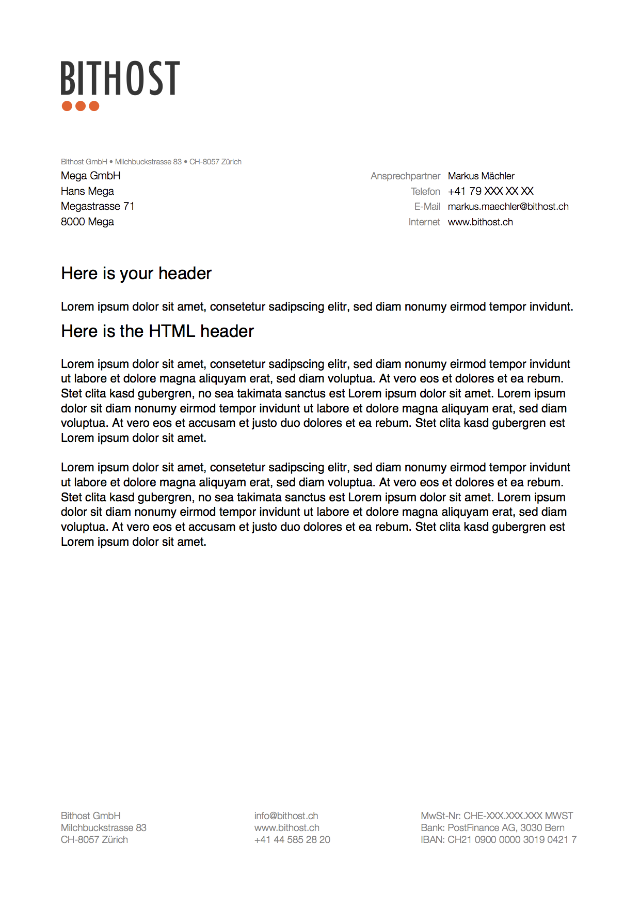

.. ==================================================
.. FOR YOUR INFORMATION
.. --------------------------------------------------
.. -*- coding: utf-8 -*- with BOM.

.. include:: ../../Includes.txt

.. _extendexistingpdfs:

Extend Existing PDFs
====================

.. _extendexistingpdfs_intro:

Intro
-----

There is the possibility to load existing PDF documents and use them as template. Under the hood pdfviewhelpers
uses FPDI_ to import PDF documents as template. You must include the static TypoScript template of the extension
in order to make this example work.

.. _FPDI: https://www.setasign.com/

.. _extendexistingpdfs_typoscript:

TypoScript
----------

::

	pdfpage = PAGE
	pdfpage {
		10 = FLUIDTEMPLATE
		10 {
			file = EXT:pdfviewhelpers/Resources/Public/Examples/ExtendExistingPDFs/Template.html
		}
		# ensure there is no other output apart from the pdf
		# take a look at the generated pdf file (end!) in a text editor to verify there is no other output
		# like warnings, error messages or html code
		config {
			disableAllHeaderCode = 1
			xhtml_cleaning = 0
			admPanel = 0
		}
	}

.. _extendexistingpdfs_fluid:

Fluid Template
--------------

::

	<html xmlns="http://www.w3.org/1999/xhtml"
		  xmlns:xsi="http://www.w3.org/2001/XMLSchema-instance"
		  xmlns:f="http://typo3.org/ns/TYPO3/CMS/Fluid/ViewHelpers"
		  xmlns:pdf="http://typo3.org/ns/Bithost/Pdfviewhelpers/ViewHelpers"
		  xsi:schemaLocation="http://typo3.org/ns/Bithost/Pdfviewhelpers/ViewHelpers https://pdfviewhelpers.bithost.ch/schema/2.0.xsd"
		  data-namespace-typo3-fluid="true">

	<pdf:document sourceFile="EXT:pdfviewhelpers/Resources/Public/Examples/ExtendExistingPDFs/pdf_template.pdf">
		<pdf:page importPage="1" margin="{top: 80, right: 20, bottom: 40, left: 20}">
			<pdf:headline>Here is your header</pdf:headline>
			<pdf:text>Lorem ipsum dolor sit amet, consetetur sadipscing elitr, sed diam nonumy eirmod tempor invidunt.</pdf:text>
			<pdf:html autoHyphenation="1">
				<h1 style="font-weight: normal; font-size: 16px;">Here is the HTML header</h1>
				
Lorem ipsum dolor sit amet, consetetur
					sadipscingelitrseddiamnonumyeirmodtemporinviduntutlaboreetdoloremagnaaliquyameratseddiam
					voluptua. At vero eos et dolores et ea rebum. Stet
					clita kasd gubergren, no sea takimata sanctus est
					Lorem ipsum dolor sit amet. Lorem ipsum dolor sit
					diam nonumy eirmod tempor invidunt ut labore et
					dolore magna aliquyam erat, sed diam voluptua. At
					vero eos et accusam et justo duo dolores et ea
					rebum. Stet clita kasd gubergren est Lorem ipsum
					dolor sit amet.

				
Lorem ipsum dolor sit amet, consetetur sadipscing
					elitr, sed diam nonumy eirmod tempor invidunt ut
					labore et dolore magna aliquyam erat, sed diam
					voluptua. At vero eos et dolores et ea rebum. Stet
					clita kasd gubergren, no sea takimata sanctus est
					Lorem ipsum dolor sit amet. Lorem ipsum dolor sit
					diam nonumy eirmod tempor invidunt ut labore et
					dolore magna aliquyam erat, sed diam voluptua. At
					vero eos et accusam et justo duo dolores et ea
					rebum. Stet clita kasd gubergren est Lorem ipsum
					dolor sit amet.

			</pdf:html>
		</pdf:page>
	</pdf:document>

	</html>

.. _extendexistingpdfs_output:

PDF Output
----------

   Rendered PDF document
