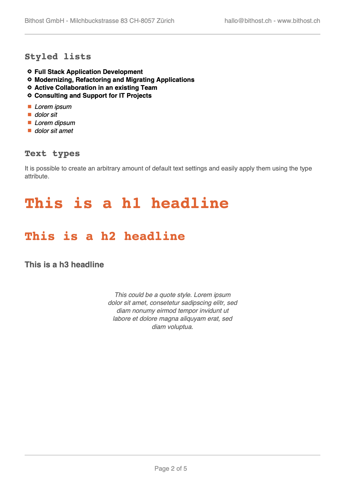

.. ==================================================
.. FOR YOUR INFORMATION
.. --------------------------------------------------
.. -*- coding: utf-8 -*- with BOM.

.. include:: ../../Includes.txt

.. _fullfeatureshowcase:

Full Feature Show Case
======================

.. _fullfeatureshowcase_intro:

Intro
-----

This example is showing some of the features of the extension pdfviewhelpers including typography, custom fonts, lists, images, html, layout and settings inheritance.

.. _fullfeatureshowcase_typoscript:

TypoScript
----------

::

	pdfpage = PAGE
	pdfpage {
		10 = FLUIDTEMPLATE
		10 {
			file = EXT:pdfviewhelpers/Resources/Public/Examples/FullFeatureShowCase/Template.html
		}
		# ensure there is no other output apart from the pdf
		# take a look at the generated pdf file (end!) in a text editor to verify there is no other output
		# like warnings, error messages or html code
		config {
			disableAllHeaderCode = 1
			xhtml_cleaning = 0
			admPanel = 0
		}
	}

	plugin.tx_pdfviewhelpers.settings {
		config {
			class = Bithost\Pdfviewhelpers\Model\FullFeatureShowCase
			jpgQuality = 80
			fonts {
				addTTFFont {
					roboto {
						path = EXT:pdfviewhelpers/Resources/Public/Examples/FullFeatureShowCase/Roboto.ttf
					}
					opensans {
						path = EXT:pdfviewhelpers/Resources/Public/Examples/FullFeatureShowCase/OpenSans.ttf
					}
				}
			}
		}
		document {
			title = Full Feature Show Case Title
			subject = No Subject
			keywords = full, feature, show, case
			outputDestination = I
			outputPath = fullfeatureshowcase.pdf
		}
		page {
			margins {
				top = 20
				right = 15
				bottom = 20
				left = 15
			}
		}
		generalText {
			color = #555
		}
		headline {
			fontFamily = courier
			fontStyle = B
		}
		list {
			color = #1F8A70
			fontStyle = I
			bulletColor = #BEDB39
		}
	}

.. _fullfeatureshowcase_php:

PHP
---

A custom PHP class is needed if you want to add header and footer to all the pages or if you want to customize
the behaviour of TCPDF in any way.

::

	<?php
	namespace Bithost\Pdfviewhelpers\Model;

	/***
	 *
	 * This file is part of the "PDF ViewHelpers" Extension for TYPO3 CMS.
	 *
	 *  (c) 2016 Markus Mächler <markus.maechler@bithost.ch>, Bithost GmbH
	 *           Esteban Marin <esteban.marin@bithost.ch>, Bithost GmbH
	 *
	 *  All rights reserved
	 *
	 *  This script is part of the TYPO3 project. The TYPO3 project is
	 *  free software; you can redistribute it and/or modify
	 *  it under the terms of the GNU General Public License as published by
	 *  the Free Software Foundation; either version 3 of the License, or
	 *  (at your option) any later version.
	 *
	 *  The GNU General Public License can be found at
	 *  http://www.gnu.org/copyleft/gpl.html.
	 *
	 *  This script is distributed in the hope that it will be useful,
	 *  but WITHOUT ANY WARRANTY; without even the implied warranty of
	 *  MERCHANTABILITY or FITNESS FOR A PARTICULAR PURPOSE.  See the
	 *  GNU General Public License for more details.
	 *
	 *  This copyright notice MUST APPEAR in all copies of the script!
	 ***/

	/**
	 * FullFeatureShowCase
	 *
	 * @author Markus Mächler <markus.maechler@bithost.ch>, Esteban Marin <esteban.marin@bithost.ch>
	 */
	class FullFeatureShowCase extends \FPDI {
		/**
		 * @return void
		 */
		public function Header() {
			$header1 = "Bithost GmbH - Milchbuckstrasse 83 CH-8057 Zürich";
			$header2 = "hallo@bithost.ch - www.bithost.ch";

			$this->SetTextColor(140, 140, 140);
			$this->SetFontSize(11);

			$this->MultiCell(null, null, $header1, 0, 'L', FALSE, 1, 15, 10, TRUE, 0, FALSE, TRUE, 0, 'T', FALSE);
			$this->MultiCell(null, null, $header2, 0, 'R', FALSE, 1, 15, 10, TRUE, 0, FALSE, TRUE, 0, 'T', FALSE);

			$this->SetDrawColor(140, 140, 140);
			$this->Line(15, $this->y + 5, $this->w - 15, $this->y + 5);
		}

		/**
		 * @return void
		 */
		public function Footer() {
			$this->SetY(-20);
			$this->SetDrawColor(140, 140, 140);
			$this->Line(15, $this->y, $this->w - 15, $this->y);

			$this->SetY(-17);
			$this->SetTextColor(140, 140, 140);
			$this->SetFontSize(11);
			$this->Cell($this->w - 15, 10, 'Page '.$this->getAliasNumPage() . ' of '.$this->getAliasNbPages(), 0, false, 'C', 0, '', 1, false, 'T', 'M');
		}
	}

.. _fullfeatureshowcase_fluid:

Fluid Template
--------------

::

	{namespace pdf=Bithost\Pdfviewhelpers\ViewHelpers}

	<pdf:document outputPath="overwritten_name.pdf">
		<pdf:page>
			<pdf:headline fontSize="20">Full Feature Show Case</pdf:headline>
			<pdf:text>Randomly showing some features of pdfviewhelpers.</pdf:text>

			<pdf:headline>Typography</pdf:headline>
			<pdf:text fontStyle="B">Bold text</pdf:text>
			<pdf:text fontStyle="I">Italic text</pdf:text>
			<pdf:text fontStyle="U">Underlined text</pdf:text>
			<pdf:text color="#1F8A70">Colored text</pdf:text>
			<pdf:text alignment="L">Alignment Left</pdf:text>
			<pdf:text alignment="C">Alignment Center</pdf:text>
			<pdf:text alignment="R">Alignment Right</pdf:text>

			<pdf:text color="#BEDB39" padding="{top:6, right:80, bottom:6, left:20}">
				Text with special padding. Lorem ipsum dolor sit amet, consetetur sadipscing elitr, sed diam nonumy eirmod tempor invidunt ut labore et dolore magna aliquyam erat, sed diam voluptua. At vero eos et dolores et ea rebum.
			</pdf:text>

			<pdf:multiColumn>
				<pdf:column>
					<pdf:text>
						Text with normal paragraph spacing.
						Shown here.
					</pdf:text>
				</pdf:column>
				<pdf:column>
					<pdf:text paragraphSpacing="2">
						Text with extended paragraph spacing.
						Shown here.
					</pdf:text>
				</pdf:column>
				<pdf:column>
					<pdf:text paragraphSpacing="4">
						Text with even more extended paragraph spacing.
						Shown here.
					</pdf:text>
				</pdf:column>
			</pdf:multiColumn>

			<pdf:multiColumn>
				<pdf:column>
					<pdf:text autoHyphenation="0" padding="{top:0, right:2, bottom:0, left:0}">
						ThisisalongtextWITHOUTautomatichyphenationbeingactivated.
					</pdf:text>
				</pdf:column>
				<pdf:column>
					<pdf:text autoHyphenation="1" padding="{top:0, right:0, bottom:0, left:2}">
						ThisisalongtextWITHautomatichyphenationbeingactivated.
					</pdf:text>
				</pdf:column>
			</pdf:multiColumn>

			<pdf:headline>Custom fonts</pdf:headline>
			<pdf:text fontFamily="opensans">Custom font Open Sans automatically converted from TTF file.</pdf:text>
			<pdf:text fontFamily="roboto">Custom font Roboto automatically converted from TTF file.</pdf:text>
			<pdf:text fontFamily="roboto" color="#BEDB39">Custom font Roboto even colored!</pdf:text>

			<pdf:headline>Strangely styled list</pdf:headline>
			<pdf:list
					color="#333"
					bulletSize="2"
					bulletColor="#1F8A70"
					fontStyle="I"
					listElements="{0: 'Websites using TYPO3', 1: 'Application Development', 2: 'Mobile Apps', 3: 'Hosting'}" />
		</pdf:page>
		<pdf:page orientation="L">
			<pdf:headline>Image in different sizes</pdf:headline>
			<pdf:image src="EXT:pdfviewhelpers/Resources/Public/Examples/FullFeatureShowCase/Bithost.jpg" width="100" />
			<pdf:image src="EXT:pdfviewhelpers/Resources/Public/Examples/FullFeatureShowCase/Bithost.jpg" width="70" />
			<pdf:image src="EXT:pdfviewhelpers/Resources/Public/Examples/FullFeatureShowCase/Bithost.jpg" width="50" />
		</pdf:page>
		<pdf:page>
			<pdf:headline>HTML content being styled externally</pdf:headline>
			<pdf:html styleSheet="EXT:pdfviewhelpers/Resources/Public/Examples/FullFeatureShowCase/styles.css">
				<h1>Headline 1</h1>
				<h2>Headline 2</h2>
				<h3>Headline 3</h3>

				<a href="https://www.bithost.ch">A Link to click</a>

				
Lorem ipsum dolor sit amet, consetetur sadipscing elitr, sed diam nonumy eirmod tempor invidunt ut labore et dolore magna aliquyam erat, sed diam voluptua.

				
Lorem ipsum dolor sit amet, consetetur sadipscing elitr, sed diam nonumy eirmod tempor invidunt ut labore et dolore magna aliquyam erat, sed diam voluptua.

				<h3 style="color: #333;">Table</h3>
				<table cellpadding="4" cellspacing="4">
					<thead>
						<tr>
							<th>Head 1</th>
							<th>Head 2</th>
							<th>Head 3</th>
						</tr>
					</thead>
					<tbody>
						<tr>
							<td>Content 1</td>
							<td>Content 2</td>
							<td>Content 3</td>
						</tr>
						<tr>
							<td>More Content 1</td>
							<td>More Content 2</td>
							<td>More Content 3</td>
						</tr>
						<tr>
							<td>Content 1</td>
							<td>Content 2</td>
							<td>Content 3</td>
						</tr>
					</tbody>
				</table>
			</pdf:html>

			<pdf:headline>Position ViewHelpers</pdf:headline>
			<pdf:text>This text will be rendered at position x={pdf:getPosX()} and y={pdf:getPosY()}</pdf:text>
		</pdf:page>
	</pdf:document>

.. _fullfeatureshowcase_output:

PDF Output
----------

   Rendered PDF document
