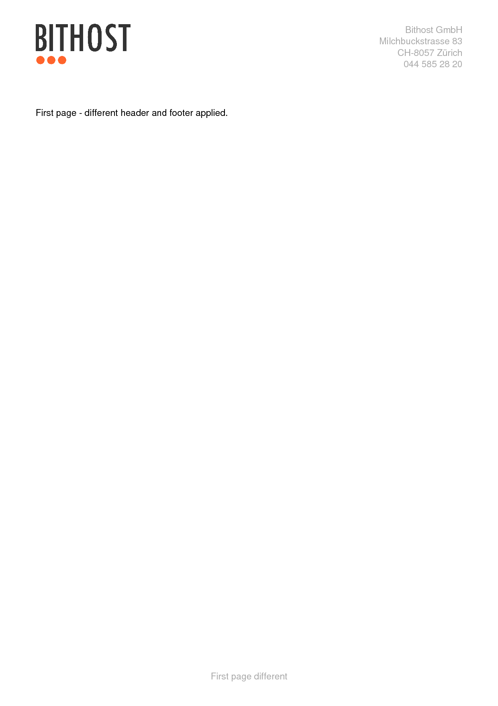

.. ==================================================
.. FOR YOUR INFORMATION
.. --------------------------------------------------
.. -*- coding: utf-8 -*- with BOM.

.. include:: ../../Includes.txt

.. _headerandfooter:

Header and Footer
=================

.. _headerandfooter_typoscript:

TypoScript
----------

::

	pdfpage = PAGE
	pdfpage {
		10 = FLUIDTEMPLATE
		10 {
			file = EXT:pdfviewhelpers/Resources/Public/Examples/HeaderAndFooter/Template.html
		}
		# ensure there is no other output apart from the pdf
		# take a look at the generated pdf file (end!) in a text editor to verify there is no other output
		# like warnings, error messages or html code
		config {
			disableAllHeaderCode = 1
			xhtml_cleaning = 0
			admPanel = 0
		}
	}

	plugin.tx_pdfviewhelpers.settings {
		page {
			autoPageBreak = 1
			margin {
				top = 25
				bottom = 25
			}
		}
		header {
			posY = 10
		}
		footer {
			posY = -15
		}
	}

	module.tx_pdfviewhelpers < plugin.tx_pdfviewhelpers

.. _headerandfooter_fluid:

Fluid Template
--------------

::

	<html xmlns="http://www.w3.org/1999/xhtml"
		  xmlns:xsi="http://www.w3.org/2001/XMLSchema-instance"
		  xmlns:f="http://typo3.org/ns/TYPO3/CMS/Fluid/ViewHelpers"
		  xmlns:pdf="http://typo3.org/ns/Bithost/Pdfviewhelpers/ViewHelpers"
		  xsi:schemaLocation="http://typo3.org/ns/Bithost/Pdfviewhelpers/ViewHelpers https://pdfviewhelpers.bithost.ch/schema/2.3.xsd"
		  data-namespace-typo3-fluid="true">

	<pdf:document outputDestination="inline" title="Bithost Example">
		<pdf:header>
			<pdf:multiColumn>
				<pdf:column>
					<pdf:text color="#AAA">Bithost GmbH</pdf:text>
				</pdf:column>
				<pdf:column>
					<pdf:text alignment="right" color="#AAA">Milchbuckstrasse 83 - 8057 Zürich</pdf:text>
				</pdf:column>
			</pdf:multiColumn>
		</pdf:header>
		<pdf:footer>
			<pdf:graphics.line style="{color: '#AAA'}" padding="{top: 0, bottom: 2}"/>
			<pdf:text color="#AAA">Page {pdf:getPageNumberAlias()} of {pdf:getTotalNumberOfPagesAlias()}</pdf:text>
		</pdf:footer>

		<pdf:page margin="{top: 45, right: 15, bottom: 25, left: 15}">
			<pdf:header scope="thisPage">
				<pdf:image src="EXT:pdfviewhelpers/Resources/Public/Examples/HeaderAndFooter/logo.png" width="40"/>
				<pdf:text color="#AAA" alignment="right" posY="10" paragraphSpacing="0">
					Bithost GmbH
					Milchbuckstrasse 83
					CH-8057 Zürich
					044 585 28 20
				</pdf:text>
			</pdf:header>
			<pdf:footer>
				<pdf:text alignment="center" color="#AAA">First page different</pdf:text>
			</pdf:footer>
			<pdf:text>
				First page - different header and footer applied.
			</pdf:text>
		</pdf:page>

		<pdf:page>
			<pdf:text>
				Page 2 - document wide header and footer applied.
			</pdf:text>
		</pdf:page>

		<pdf:page>
			<pdf:footer scope="thisPage">
				<pdf:text color="#AAA">Change footer only on first page even if page break occurs.</pdf:text>
			</pdf:footer>
			<pdf:text>
				Page 3 - document wide header but page specific footer applied.
			</pdf:text>

			<pdf:pageBreak/>

			<pdf:text>
				Page 4 - Again document wide header and footer applied.
			</pdf:text>
		</pdf:page>
	</pdf:document>

	</html>

.. _headerandfooter_output:

PDF Output
----------

|

|

|

|
