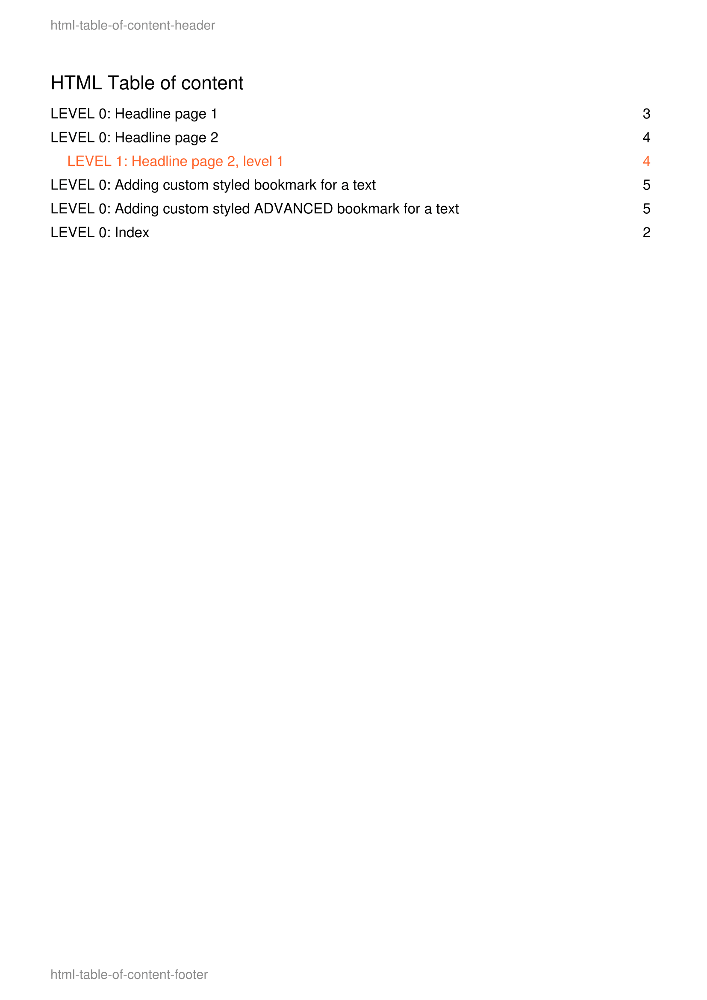
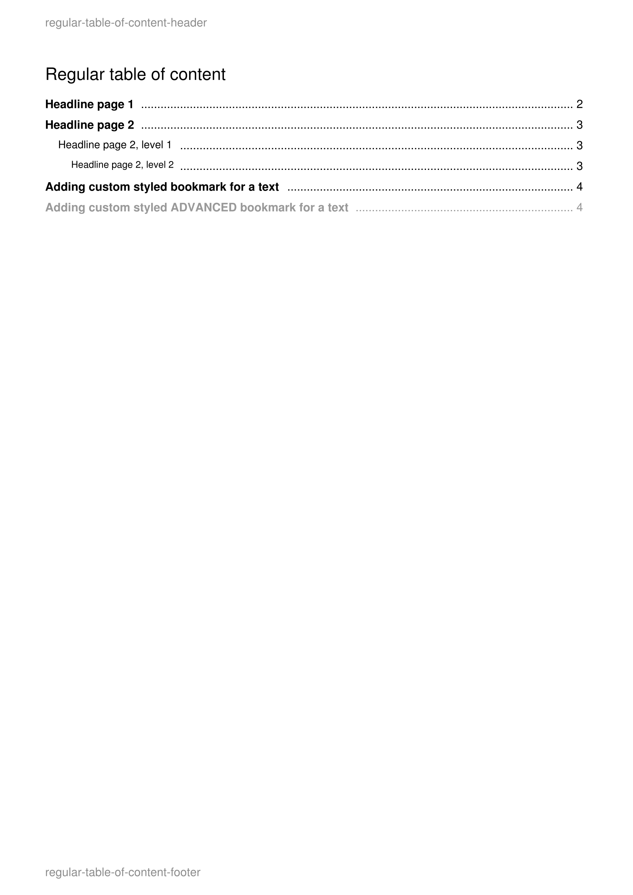
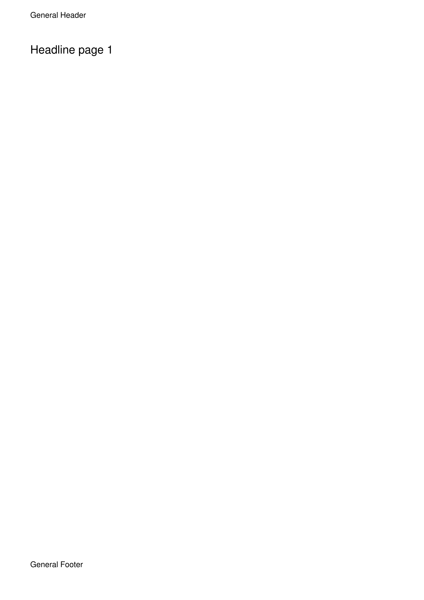
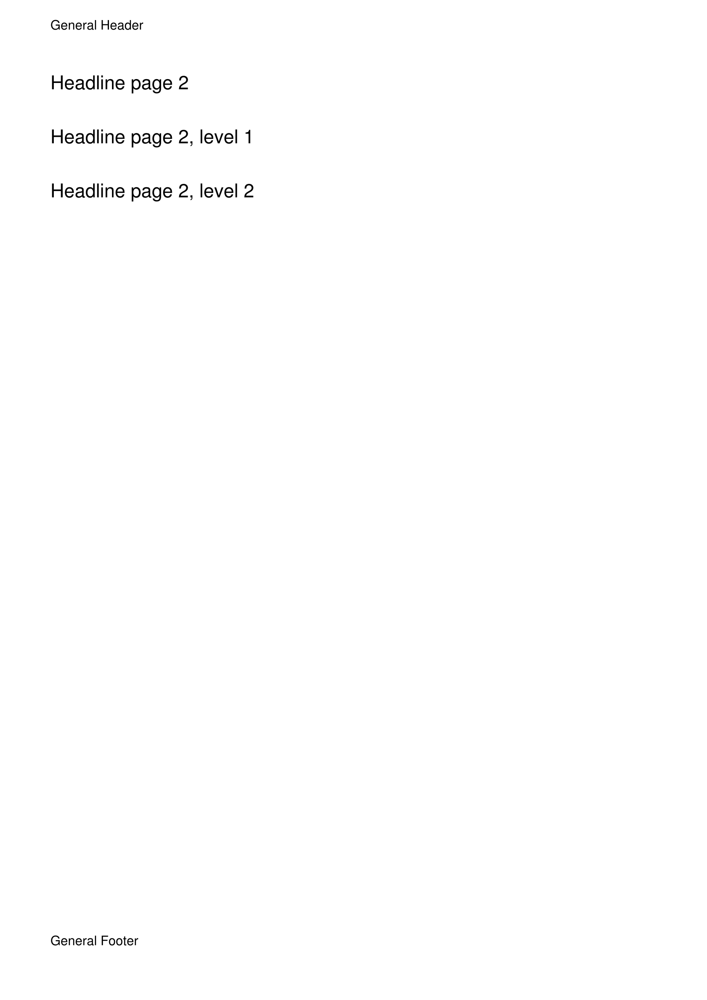
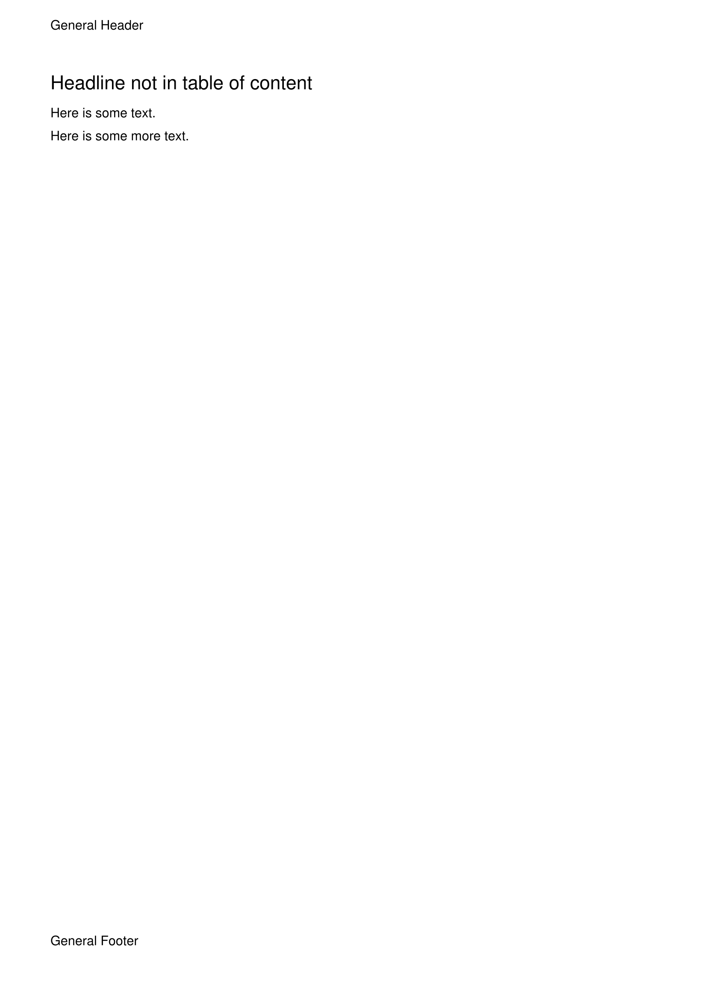

.. ==================================================
.. FOR YOUR INFORMATION
.. --------------------------------------------------
.. -*- coding: utf-8 -*- with BOM.

.. include:: ../../Includes.txt

.. _tableofcontent:

Table Of Content
================

**IMPORTANT NOTICE:** Please note that TCPDF does not produce valid PDF documents when bookmarks are used.
Although most PDF viewers are still able to render the document you might run into validity troubles using these ViewHelpers.

.. _tableofcontent_typoscript:

TypoScript
----------

::

	pdfpage = PAGE
	pdfpage {
		10 = FLUIDTEMPLATE
		10 {
			file = EXT:pdfviewhelpers/Resources/Public/Examples/TableOfContent/Template.html
		}
		# ensure there is no other output apart from the pdf
		# take a look at the generated pdf file (end!) in a text editor to verify there is no other output
		# like warnings, error messages or html code
		config {
			disableAllHeaderCode = 1
			xhtml_cleaning = 0
			admPanel = 0
		}
	}
	
	plugin.tx_pdfviewhelpers.settings {
		headline {
			addToTableOfContent = 1
		}
	}
	
	module.tx_pdfviewhelpers < plugin.tx_pdfviewhelpers

.. _tableofcontent_fluid:

Fluid Template
--------------

::

	<html xmlns="http://www.w3.org/1999/xhtml"
		  xmlns:xsi="http://www.w3.org/2001/XMLSchema-instance"
		  xmlns:f="http://typo3.org/ns/TYPO3/CMS/Fluid/ViewHelpers"
		  xmlns:pdf="http://typo3.org/ns/Bithost/Pdfviewhelpers/ViewHelpers"
		  xsi:schemaLocation="http://typo3.org/ns/Bithost/Pdfviewhelpers/ViewHelpers https://pdfviewhelpers.bithost.ch/schema/2.3.xsd"
		  data-namespace-typo3-fluid="true">
	
	<pdf:document outputDestination="inline">
		<pdf:header>
			<pdf:text>General Header</pdf:text>
		</pdf:header>
		<pdf:footer posY="-20">
			<pdf:text>General Footer</pdf:text>
		</pdf:footer>
	
		<pdf:page>
			<pdf:headline>Headline page 1</pdf:headline>
	
			<pdf:pageBreak />
	
			<pdf:headline>Headline page 2</pdf:headline>
			<pdf:headline tableOfContentLevel="1">Headline page 2, level 1</pdf:headline>
			<pdf:headline tableOfContentLevel="2">Headline page 2, level 2</pdf:headline>
	
			<pdf:pageBreak />
	
			<pdf:headline addToTableOfContent="0">Headline not in table of content</pdf:headline>
	
			<pdf:bookmark level="0" text="Adding custom styled bookmark for a text" />
			<pdf:text>Here is some text.</pdf:text>
	
			<pdf:bookmark level="0" fontStyle="B" color="#999">Adding custom styled ADVANCED bookmark for a text</pdf:bookmark>
			<pdf:text>Here is some more text.</pdf:text>
		</pdf:page>
	
		<pdf:page tableOfContentPage="1">
			<pdf:header>
				<pdf:text color="#8C8C8C">regular-table-of-content-header</pdf:text>
			</pdf:header>
			<pdf:footer>
				<pdf:text color="#8C8C8C">regular-table-of-content-footer</pdf:text>
			</pdf:footer>
	
			<pdf:headline addToTableOfContent="0">Regular table of content</pdf:headline>
			<pdf:tableOfContent page="1" name="Index" />
		</pdf:page>
	
		<pdf:page tableOfContentPage="1">
			<pdf:header>
				<pdf:text color="#8C8C8C">html-table-of-content-header</pdf:text>
			</pdf:header>
			<pdf:footer>
				<pdf:text color="#8C8C8C">html-table-of-content-footer</pdf:text>
			</pdf:footer>
	
			<pdf:headline addToTableOfContent="0">HTML Table of content</pdf:headline>
			<pdf:tableOfContent page="1" name="Index" htmlMode="1">
				<pdf:htmlBookmarkTemplate level="0">
					<table border="0" cellpadding="0" cellspacing="0">
						<tr>
							<td width="155mm">
								LEVEL 0: #TOC_DESCRIPTION#
							</td>
							<td width="25mm">
								#TOC_PAGE_NUMBER#
							</td>
						</tr>
					</table>
				</pdf:htmlBookmarkTemplate>
				<pdf:htmlBookmarkTemplate level="1">
					<table border="0" cellpadding="0" cellspacing="0">
						<tr>
							<td width="5mm">&nbsp;</td>
							<td width="150mm">
								LEVEL 1: #TOC_DESCRIPTION#
							</td>
							<td width="25mm">
								#TOC_PAGE_NUMBER#
							</td>
						</tr>
					</table>
				</pdf:htmlBookmarkTemplate>
			</pdf:tableOfContent>
		</pdf:page>
	</pdf:document>
	
	</html>

.. _tableofcontent_output:

PDF Output
----------

|

|

|

|

|