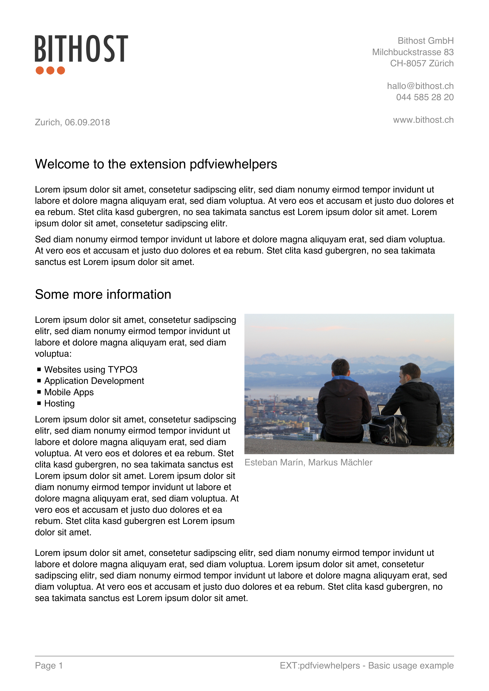

[](https://typo3.org/)
[](https://typo3.org/)
[](https://typo3.org/)
[](https://travis-ci.org/bithost-gmbh/pdfviewhelpers)

# TYPO3 CMS Extension pdfviewhelpers

## Introduction
This is a TYPO3 CMS extension that provides various Fluid ViewHelpers to generate PDF documents.
Using the ViewHelpers from this extension you can make any Fluid template into a PDF document.
The extension `pdfviewhelpers` is using [TCPDF](https://tcpdf.org/) and [FPDI](https://www.setasign.com/products/fpdi) for the PDF generation.

## Key features

- ViewHelpers to render text and lists
- ViewHelper to render images (supporting FAL)
- ViewHelpers to repeatedly render header and footer
- ViewHelper to render HTML / rich-text content
- ViewHelper to avoid page breaks inside
- ViewHelpers to create a multi column layout
- Load existing PDF documents as template
- Define and apply different text styles easily
- Fully customizable by writing your own ViewHelpers
- Rich inheritance based TypoScript settings
- Supported output destinations: string, inline, download and file
- Usable both in frontend and backend

## Example

### Fluid Template
```xml
<html xmlns="http://www.w3.org/1999/xhtml"
      xmlns:xsi="http://www.w3.org/2001/XMLSchema-instance"
      xmlns:f="http://typo3.org/ns/TYPO3/CMS/Fluid/ViewHelpers"
      xmlns:pdf="http://typo3.org/ns/Bithost/Pdfviewhelpers/ViewHelpers"
      xsi:schemaLocation="http://typo3.org/ns/Bithost/Pdfviewhelpers/ViewHelpers https://pdfviewhelpers.bithost.ch/schema/2.0.xsd"
      data-namespace-typo3-fluid="true">
    
<pdf:document outputDestination="inline" title="Bithost Example">
    <pdf:header>
        <pdf:image src="EXT:pdfviewhelpers/Resources/Public/Examples/BasicUsage/logo.png" width="40" />
        <pdf:text alignment="right" color="#8C8C8C" paragraphSpacing="0" posY="15">
            Bithost GmbH
            Milchbuckstrasse 83
            CH-8057 Zürich
    
            hallo@bithost.ch
            044 585 28 20
    
            www.bithost.ch
        </pdf:text>
    </pdf:header>
    <pdf:footer>
        <pdf:graphics.line style="{color: '#8C8C8C'}" />
        <pdf:multiColumn>
            <pdf:column>
                <pdf:text color="#8C8C8C">Page {pdf:getPageNumberAlias()}</pdf:text>
            </pdf:column>
            <pdf:column>
                <pdf:text alignment="right" color="#8C8C8C">
                    EXT:pdfviewhelpers - Basic usage example
                </pdf:text>
            </pdf:column>
        </pdf:multiColumn>
    </pdf:footer>
    
    <pdf:page>
        <pdf:text posY="50" padding="{bottom: 4}" color="#8C8C8C">
            Zurich, <f:format.date format="d.m.Y" >now</f:format.date>
        </pdf:text>
        <pdf:headline>Welcome to the extension pdfviewhelpers</pdf:headline>
        <pdf:text>Lorem ipsum [..] diam voluptua:</pdf:text>
        <pdf:headline>Some more information</pdf:headline>
    
        <pdf:multiColumn>
            <pdf:column width="55%">
                <pdf:text>
                    Lorem ipsum [..] voluptua:
                </pdf:text>
                <pdf:list listElements="{0: 'Websites using TYPO3', 1: 'Application Development', 2: 'Mobile Apps', 3: 'Hosting'}"/>
                <pdf:text>
                    Lorem ipsum  [..] sit amet.
                </pdf:text>
            </pdf:column>
            <pdf:column width="45%" padding="{left: 2}">
                <pdf:image src="EXT:pdfviewhelpers/Resources/Public/Examples/BasicUsage/Bithost.jpg" />
                <pdf:text padding="{top: 1}" color="#8C8C8C">Esteban Marín, Markus Mächler</pdf:text>
            </pdf:column>
        </pdf:multiColumn>
    
        <pdf:text>Lorem ipsum  [..]  sit amet.</pdf:text>
        <pdf:text>Lorem ipsum  [..]  sit amet.</pdf:text>
    </pdf:page>
</pdf:document>

</html>

```

### PDF Output



## Bug Tracker

https://github.com/bithost-gmbh/pdfviewhelpers/issues

## Git Repository

https://github.com/bithost-gmbh/pdfviewhelpers

## TER 

https://typo3.org/extensions/repository/view/pdfviewhelpers

## Packagist 

https://packagist.org/packages/bithost-gmbh/pdfviewhelpers

## Full Documentation

https://docs.typo3.org/typo3cms/extensions/pdfviewhelpers

## Contact

* [@maechler](https://github.com/maechler) 
* [@macjohnny](https://github.com/macjohnny)
* https://www.bithost.ch/kontakt/
